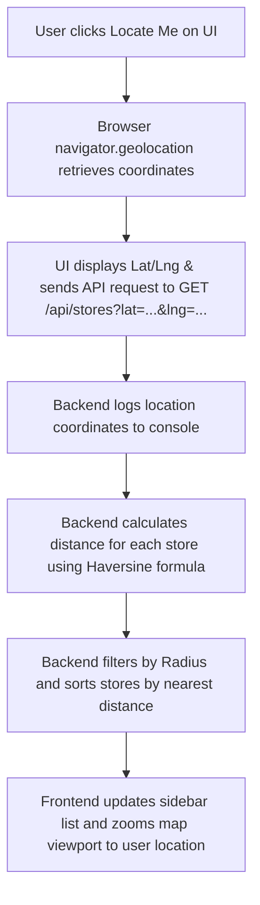

# Store Locator Application

A premium, interactive Store Locator application featuring a modular **FastAPI** backend with a JSON-based database, and a highly responsive **React + Vite** frontend utilizing **OpenStreetMap (Leaflet)** with marker clustering.

---

## 🛠️ Technology Stack

### Backend
- **FastAPI**: Modern, high-performance web framework for building APIs.
- **Uvicorn**: Lightning-fast ASGI web server implementation.
- **Pandas & Openpyxl**: Data analysis library used to parse, normalize, and read uploaded CSV and Excel (`.xlsx`) files.
- **Pure Python Math**: Optimized implementation of the Haversine formula to compute great-circle distances between points on the earth.
- **JSON File Store**: No database setup required. Data is stored directly and safely in `stores.json`.

### Frontend
- **React (Vite)**: Fast, modern frontend build tool and React framework.
- **Leaflet & React Leaflet**: Open-source JavaScript libraries for mobile-friendly interactive maps.
- **Leaflet.markercluster**: Custom plugin integration to cluster overlapping markers.
- **Vanilla CSS**: Clean layout styling using CSS variables, flexbox grid alignments, subtle micro-animations (pulsing geo-pins, active hover transitions), and native mobile responsiveness.

---

## 📁 Project Architecture & Modular Design

The codebase is split cleanly into a modular backend and a frontend:

```text
Store_Locator/
├── backend/
│   ├── main.py                  # Server entrypoint, CORS configuration & static mounts
│   ├── config.py                # Configurations (file sizes, allowed formats, radius list)
│   ├── routes/
│   │   ├── stores.py            # API routes for querying, filtering, and sorting stores
│   │   └── upload.py            # API route for CSV/Excel file uploading
│   ├── services/
│   │   ├── store_service.py     # Seed management, list loading, filtering & sorting logic
│   │   └── upload_service.py    # Spreadsheet reading, row-by-row validation & duplicate checks
│   ├── utils/
│   │   └── distance.py          # Haversine distance calculator
│   └── data/
│       └── stores.json          # Active database of stores (seeded with locations on launch)
└── frontend/
    ├── package.json             # React, Leaflet, and build dependencies
    ├── vite.config.js           # Reverse-proxy setting to forward API requests
    ├── index.html               # Main HTML entrypoint (includes Leaflet CSS)
    └── src/
        ├── main.jsx             # React DOM rendering entrypoint
        ├── App.jsx              # Main container orchestrating filters, query debounces & modals
        ├── global-leaflet.js    # Bypasses ES6 hoisting issues to mount Leaflet globally
        ├── leaflet-setup.js     # Dynamically packages marker clustering plugins
        ├── index.css            # Stylesheets (mobile layouts, custom pins, active cards)
        └── components/
            ├── Sidebar.jsx      # Filters, geolocation triggers, compact upload dropzone
            ├── StoreCard.jsx    # Card elements with phone, addresses, and maps button
            ├── StoreMap.jsx     # Handles Leaflet maps, custom markers, popups & clustering
            └── UploadSummaryModal.jsx # Detailed stats & row-wise validation logs popup
```

---

## 🔄 Core Application Workflows

### 1. Geolocation & Proximity Sorting Workflow


### 2. Interactive Map-Sidebar Synchronization Workflow
- **Sidebar-to-Map**: Clicking a store card in the sidebar triggers the map view to smoothly pan/zoom to the corresponding marker and opens its detail popup.
- **Map-to-Sidebar**: Clicking a marker pin on the map flags the store as active, highlights its card in the sidebar, and dynamically triggers a smooth container scroll to bring that card right into view.

### 3. Safe Import/Migration Workflow
```mermaid
graph TD
    A[User drops CSV or Excel file] --> B[API validates file size (<10MB) & extension]
    B --> C[Pandas parses file and normalizes headers]
    C --> D[Service writes parsed records to uploaded_stores.json]
    D --> E[Row-wise validation checks: non-empty Name, coordinates between -90/90 and -180/180]
    E --> F{Are there validation errors?}
    F -- Yes --> G[Abort import: Return 400 with row numbers and errors. Keep stores.json unchanged]
    F -- No --> H[Filter duplicates: Check by ID or matching Name+Lat+Lng]
    H --> I[Overwrite stores.json with new unique stores & return upload summary]
```

---

## 🚀 Running the Project Locally

### Prerequisites
Make sure you have [Node.js](https://nodejs.org/) and [Python 3](https://www.python.org/) installed.

### 1. Launch the Backend (FastAPI)
1. Open your terminal in the root folder `Store_Locator`.
2. Install Python dependencies:
   ```bash
   pip install -r backend/requirements.txt
   ```
3. Run the FastAPI ASGI server:
   ```bash
   python -m uvicorn backend.main:app --reload --port 8000
   ```
4. Access the API documentation at: `http://localhost:8000/docs`.

### 2. Launch the Frontend (React + Vite)
1. Open a separate terminal window.
2. Navigate into the `frontend` folder:
   ```bash
   cd frontend
   ```
3. Install package dependencies (If PowerShell blocks standard script execution, use `.cmd`):
   ```bash
   npm.cmd install
   ```
4. Start the frontend developer server:
   ```bash
   npm.cmd run dev
   ```
5. Open `http://localhost:5173` in your browser. The Vite development proxy will route API queries seamlessly to `http://localhost:8000`.
